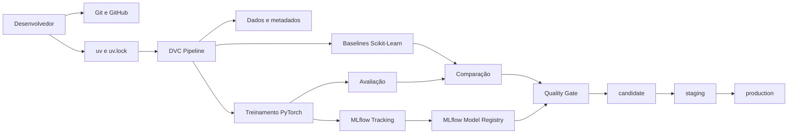

# MovieLens Recommender System com uv

Sistema de recomendação baseado no dataset **MovieLens 100K**, desenvolvido como
um projeto completo de Machine Learning Engineering e MLOps.

A versão atual implementa código modular, ambiente reproduzível, treinamento com
PyTorch, comparação com baselines do Scikit-Learn, pipeline DVC, rastreamento com
MLflow, Model Registry, quality gate e promoção controlada para Staging e
Production.

```text
Versão: 0.4.0
Python: 3.12
Testes automatizados: 63
Modelo registrado: movielens-mlp-recommender
Alias de produção: production
```

## Visão geral da entrega

O repositório contempla as quatro etapas do Tech Challenge:

- **Etapa 1 — Clean Code e Estrutura**
- **Etapa 2 — Ambiente e Dependências**
- **Etapa 3 — DVC, Docker e MLflow**
- **Etapa 4 — Rede Neural, Registry e Entrega**

Também inclui documentação técnica específica:

- [Model Card](docs/model_card.md)
- [Arquitetura do pipeline e do deploy](docs/architecture.md)
- [Plano de monitoramento](docs/monitoring.md)

## Objetivo

Construir um pipeline profissional e reproduzível de recomendação de filmes, com:

- organização modular no layout `src`;
- Clean Code, type hints e docstrings;
- padrões Factory, Strategy, Template Method e Repository;
- ambiente gerenciado por `uv`;
- lockfile versionado;
- treinamento de uma MLP com embeddings em PyTorch;
- comparação com baselines do Scikit-Learn;
- avaliação com múltiplas métricas;
- pipeline versionado e incremental com DVC;
- rastreamento de experimentos com MLflow;
- registro e versionamento no MLflow Model Registry;
- aliases `candidate`, `staging` e `production`;
- quality gate para promoção;
- metadados de aprovação e rastreabilidade;
- Dockerfile multi-stage e Docker Compose;
- testes, lint, type checking, pre-commit e CI.

## Resultado principal

O modelo neural obteve as seguintes métricas no conjunto de teste:

| Métrica | Valor |
|---|---:|
| RMSE normalizado | 0.247124 |
| MAE normalizado | 0.197192 |
| MSE normalizado | 0.061070 |
| R² | 0.226679 |
| Median Absolute Error | 0.166689 |
| RMSE na escala original | 0.988496 |
| MAE na escala original | 0.788768 |

O quality gate foi configurado como:

```yaml
quality_gate:
  selection_metric: rmse
  maximum_rmse: 0.26
```

Resultado:

```text
RMSE observado: 0.247124
Limite máximo:  0.260000
Quality gate:   passed
```

O baseline `ridge_one_hot` apresentou RMSE menor, aproximadamente `0.236167`, e
foi o vencedor da comparação. A MLP foi promovida porque passou no limite absoluto
de qualidade e o projeto está configurado com:

```yaml
require_comparison_winner: false
```

Essa decisão é documentada explicitamente no
[Model Card](docs/model_card.md).

## Quick start para usuário externo

Esta é a sequência recomendada para clonar, instalar, testar e reproduzir o
projeto em outra máquina Linux.

### 1. Clonar o repositório

```bash
git clone https://github.com/RafaExMachina/movielens-recommender-uv.git
cd movielens-recommender-uv
```

### 2. Criar o arquivo de ambiente

```bash
cp .env.example .env
```

Para execução local, confirme:

```dotenv
APP_ENV=development
LOG_LEVEL=INFO
MLFLOW_TRACKING_URI=http://localhost:5000
```

### 3. Instalar o ambiente reproduzível

```bash
uv sync --locked
```

### 4. Validar a instalação

```bash
uv run python scripts/validate_env.py
uv lock --check
```

### 5. Preparar o remote DVC local

O projeto usa um diretório fora do repositório para cache DVC:

```bash
mkdir -p ../movielens-dvc-storage
```

Esse remote é útil para `dvc push` e `dvc pull`, mas não é necessário para obter o
dataset bruto. O MovieLens 100K é baixado automaticamente pelo estágio `download`.

### 6. Iniciar o MLflow

```bash
docker compose up -d mlflow
```

Confirme:

```bash
curl -fsS http://localhost:5000/version
echo
```

Resultado esperado:

```text
2.14.0
```

A interface fica disponível em:

```text
http://localhost:5000
```

### 7. Reproduzir o pipeline completo

```bash
uv run dvc repro promote_production
```

Esse comando executa apenas as etapas necessárias e termina com:

```text
register
→ promote_staging
→ promote_production
```

Também é possível executar todo o grafo com:

```bash
uv run dvc repro
```

### 8. Verificar o estado

```bash
uv run dvc status
uv run dvc metrics show
uv run dvc dag
```

Resultado esperado do status:

```text
Data and pipelines are up to date.
```

### 9. Executar a suíte de qualidade

```bash
make check
```

O comando executa:

- Ruff;
- mypy;
- Pytest;
- pre-commit.

Resultado esperado:

```text
63 passed
```

### 10. Gerar o pacote

```bash
uv build
```

Arquivos esperados:

```text
dist/movielens_recommender-0.4.0.tar.gz
dist/movielens_recommender-0.4.0-py3-none-any.whl
```

## Arquitetura de alto nível



A descrição completa está em
[docs/architecture.md](docs/architecture.md).

## Pipeline DVC

O pipeline atual possui dez estágios:

```text
download
   ↓
preprocess
   ↓
feature_eng
   ├───────────────┐
   ↓               ↓
train          baseline
   ↓               ↓
evaluate ─────→ compare
   ↓               ↓
   └──────────→ register
                    ↓
             promote_staging
                    ↓
             promote_production
```

### `download`

Baixa e extrai o MovieLens 100K em:

```text
data/raw/ml-100k/
```

### `preprocess`

Limpa e valida os registros, produzindo:

```text
data/interim/ratings_clean.csv
```

### `feature_eng`

Cria as divisões e os metadados:

```text
data/processed/train.csv
data/processed/valid.csv
data/processed/test.csv
data/processed/metadata.json
```

### `train`

Treina a MLP em PyTorch, registra a execução no MLflow e salva:

```text
models/checkpoints/model.pt
models/registry/training_run.json
reports/metrics/train_metrics.json
```

### `evaluate`

Avalia o checkpoint no conjunto de teste e salva:

```text
reports/metrics/evaluation_metrics.json
```

### `baseline`

Treina e avalia:

```text
dummy_mean
dummy_median
ridge_one_hot
```

Saída:

```text
reports/metrics/baseline_metrics.json
```

### `compare`

Compara a MLP com os baselines usando múltiplas métricas.

Saída:

```text
reports/metrics/model_comparison.json
```

### `register`

Registra ou reutiliza a versão correspondente ao Run ID e associa o alias:

```text
candidate
```

Saída:

```text
models/registry/registered_model.json
```

### `promote_staging`

Valida o quality gate e promove a mesma versão para:

```text
staging
```

Saída:

```text
models/registry/staging_promotion.json
```

### `promote_production`

Exige passagem prévia por Staging e promove para:

```text
production
```

Saída:

```text
models/registry/production_promotion.json
```

## MLflow Experiment Tracking

O experimento padrão é:

```text
movielens-recommender
```

O treinamento registra:

- hiperparâmetros;
- métricas;
- perdas;
- melhor época;
- artefatos;
- assinatura do modelo;
- exemplo de entrada;
- checkpoint;
- Run ID.

Run correspondente à versão atual:

```text
dce4e464561d4af99f1752d0bbcc87bd
```

## MLflow Model Registry

Modelo registrado:

```text
movielens-mlp-recommender
```

Versão atual:

```text
1
```

Aliases:

```text
candidate
staging
production
```

URIs:

```text
models:/movielens-mlp-recommender@candidate
models:/movielens-mlp-recommender@staging
models:/movielens-mlp-recommender@production
```

O alias é a referência estável. Um consumidor não precisa conhecer o número da
versão, apenas o nome lógico aprovado.

### Validar os aliases

```bash
uv run python - <<'PY'
import mlflow
from mlflow import MlflowClient

from recommender.utils.settings import get_settings

tracking_uri = str(get_settings().mlflow_tracking_uri)

mlflow.set_tracking_uri(tracking_uri)
mlflow.set_registry_uri(tracking_uri)

client = MlflowClient()
name = "movielens-mlp-recommender"

for alias in ("candidate", "staging", "production"):
    model_version = client.get_model_version_by_alias(name, alias)
    print(
        f"{alias}: versão={model_version.version}, "
        f"run_id={model_version.run_id}, "
        f"stage={model_version.current_stage}"
    )
PY
```

Todos os aliases podem apontar para a mesma versão. Nesse caso, o campo legado
`current_stage` pertence à versão e poderá aparecer como `Production` nas três
consultas.

## Promoção e governança

O fluxo de governança é:

```text
candidate
   ↓ quality gate
staging
   ↓ aprovação
production
```

A promoção valida:

- status `READY`;
- nome e versão;
- Run ID de origem;
- RMSE e limite;
- passagem por Staging;
- responsável;
- justificativa;
- data UTC;
- vencedor da comparação;
- política de promoção.

Configuração:

```yaml
promotion:
  staging_alias: staging
  production_alias: production
  require_quality_gate: true
  require_staging_before_production: true
  require_comparison_winner: false
  sync_legacy_stage: true
```

O estágio legado do MLflow 2.14 foi mantido apenas para compatibilidade visual.
Os aliases são a referência principal da aplicação.

## Consumir o modelo aprovado

Exemplo conceitual:

```python
import mlflow
import pandas as pd

mlflow.set_tracking_uri("http://localhost:5000")
mlflow.set_registry_uri("http://localhost:5000")

model = mlflow.pyfunc.load_model(
    "models:/movielens-mlp-recommender@production"
)

sample = pd.DataFrame(
    [{"user_id": 10, "item_id": 42}]
)

prediction = model.predict(sample)
print(prediction)
```

O modelo espera usuários e itens conhecidos pelo treinamento. O tratamento de
cold start é uma evolução futura.

## Execução com Docker

### Requisitos

- Docker;
- Docker Compose;
- Git.

Confirme:

```bash
docker --version
docker compose version
```

### Preparar o ambiente

```bash
cp .env.example .env

export LOCAL_UID="$(id -u)"
export LOCAL_GID="$(id -g)"

mkdir -p ../movielens-dvc-storage
```

### Construir a imagem

```bash
docker compose build pipeline
```

### Iniciar o MLflow

```bash
docker compose up -d mlflow
docker compose ps
```

O serviço deve ficar saudável.

### Executar o pipeline

```bash
docker compose run --rm pipeline
```

Dentro da rede Docker, a aplicação utiliza:

```text
MLFLOW_TRACKING_URI=http://mlflow:5000
```

### Forçar a reconstrução completa

```bash
docker compose run --rm pipeline \
  sh -eu -c '
    printf "%s\n" \
      "[core]" \
      "    no_scm = true" \
      > /app/.dvc/config.local

    uv run dvc repro --force --no-run-cache
    uv run dvc push
    uv run dvc metrics show
    uv run dvc status
  '
```

### Encerrar

```bash
docker compose down
```

Para remover também os dados persistidos do MLflow:

```bash
docker compose down -v
```

> Esse comando apaga o banco e os artefatos armazenados nos volumes Docker.

## Estrutura do projeto

```text
movielens-recommender-uv/
├── .dvc/
│   └── config
├── .github/
│   └── workflows/
│       └── ci.yml
├── configs/
│   ├── config.yaml
│   ├── logging.yaml
│   └── model_config.yaml
├── data/
│   ├── features/
│   ├── interim/
│   ├── processed/
│   └── raw/
├── docs/
│   ├── architecture.md
│   ├── model_card.md
│   └── monitoring.md
├── models/
│   ├── checkpoints/
│   ├── exported/
│   └── registry/
│       ├── training_run.json
│       ├── registered_model.json
│       ├── staging_promotion.json
│       └── production_promotion.json
├── notebooks/
├── reports/
│   ├── figures/
│   ├── metrics/
│   │   ├── train_metrics.json
│   │   ├── evaluation_metrics.json
│   │   ├── baseline_metrics.json
│   │   └── model_comparison.json
│   └── predictions/
├── scripts/
│   ├── compare_models.py
│   ├── download_data.py
│   ├── evaluate.py
│   ├── predict.py
│   ├── promote_model.py
│   ├── register_model.py
│   ├── run_baselines.py
│   ├── run_pipeline.py
│   ├── train.py
│   └── validate_env.py
├── src/
│   └── recommender/
│       ├── data/
│       ├── evaluation/
│       ├── features/
│       ├── inference/
│       ├── models/
│       ├── pipeline/
│       ├── repositories/
│       ├── tracking/
│       ├── training/
│       └── utils/
├── tests/
│   ├── test_base_pipeline.py
│   ├── test_baselines.py
│   ├── test_comparison.py
│   ├── test_data_loader.py
│   ├── test_features.py
│   ├── test_metrics.py
│   ├── test_model_factory.py
│   ├── test_model_promotion.py
│   ├── test_model_registry.py
│   ├── test_pipeline_stages.py
│   ├── test_preprocess.py
│   ├── test_settings.py
│   └── test_training_pipeline.py
├── .dockerignore
├── .env.example
├── .gitignore
├── .pre-commit-config.yaml
├── .python-version
├── Dockerfile
├── Makefile
├── docker-compose.yml
├── dvc.lock
├── dvc.yaml
├── params.yaml
├── pyproject.toml
├── README.md
└── uv.lock
```

## Clean Code e padrões de projeto

### Factory

```text
src/recommender/models/model_factory.py
```

Centraliza a criação dos modelos.

### Strategy

```text
src/recommender/evaluation/metric_strategy.py
```

Permite estratégias de avaliação extensíveis.

### Template Method

```text
src/recommender/pipeline/base_pipeline.py
```

Define o fluxo geral dos pipelines.

### Repository

```text
src/recommender/repositories/artifact_repository.py
```

Abstrai a persistência de artefatos e metadados.

## Configuração

Os hiperparâmetros e políticas ficam em:

```text
params.yaml
```

Principais grupos:

```text
data
model
training
tracking
artifacts
evaluation
baselines
quality_gate
registry
promotion
```

Configurações de ambiente são carregadas por Pydantic Settings.

| Variável | Descrição | Padrão |
|---|---|---|
| `APP_ENV` | ambiente da aplicação | `development` |
| `LOG_LEVEL` | nível de log | `INFO` |
| `MLFLOW_TRACKING_URI` | servidor MLflow | `http://localhost:5000` |

## PyTorch CPU

O projeto utiliza o índice CPU:

```toml
[tool.uv.sources]
torch = { index = "pytorch-cpu" }

[[tool.uv.index]]
name = "pytorch-cpu"
url = "https://download.pytorch.org/whl/cpu"
explicit = true
```

Valide:

```bash
uv run python -c \
'import torch; print("PyTorch:", torch.__version__); print("CUDA:", torch.cuda.is_available())'
```

Resultado esperado:

```text
CUDA: False
```

## Testes

Execute:

```bash
uv run pytest
```

Ou:

```bash
make test
```

A versão `0.4.0` possui:

```text
63 testes automatizados
```

Entre eles:

- pipeline base;
- dados e preprocessamento;
- features;
- métricas;
- Factory;
- treinamento;
- baselines;
- comparação;
- configurações;
- Model Registry;
- promoção Staging/Production.

## Qualidade de código

### Ruff

```bash
uv run ruff check src tests scripts
```

### Formatação

```bash
uv run ruff format src tests scripts
```

### mypy

```bash
uv run mypy src
```

### pre-commit

```bash
uv run pre-commit run --all-files
```

### Validação completa

```bash
make check
```

## Build

```bash
uv build
```

Verifique a versão instalada:

```bash
uv run python - <<'PY'
from importlib.metadata import version

print(version("movielens-recommender"))
PY
```

Resultado:

```text
0.4.0
```

## Integração contínua

O workflow fica em:

```text
.github/workflows/ci.yml
```

A CI executa verificações de qualidade em pushes e pull requests:

- instalação reproduzível;
- Ruff;
- mypy;
- Pytest;
- pre-commit.

## Documentação

| Documento | Conteúdo |
|---|---|
| [Model Card](docs/model_card.md) | desempenho, limitações, vieses e governança |
| [Arquitetura](docs/architecture.md) | pipeline, Registry, entrega e rollback |
| [Monitoramento](docs/monitoring.md) | métricas, alertas, drift e retreinamento |

## Etapas concluídas

### Etapa 1 — Clean Code e Estrutura

- estrutura modular;
- naming conventions;
- SOLID;
- type hints;
- docstrings Google;
- Factory, Strategy, Template Method e Repository;
- Ruff;
- pre-commit;
- testes;
- GitHub Actions.

### Etapa 2 — Ambiente e Dependências

- `pyproject.toml`;
- dependências de produção e desenvolvimento;
- `uv.lock`;
- Python 3.12;
- Pydantic Settings;
- `.env.example`;
- script de validação;
- instalação limpa;
- wheel e source distribution.

### Etapa 3 — Containerização e Versionamento

- Dockerfile multi-stage;
- usuário não-root;
- Docker Compose;
- MLflow;
- DVC;
- download reproduzível;
- pipeline incremental;
- métricas e artefatos;
- remote local;
- persistência do MLflow.

### Etapa 4 — Rede Neural, Registry e Entrega

- MLP com embeddings em PyTorch;
- baselines Scikit-Learn;
- comparação com múltiplas métricas;
- Model Registry;
- versão registrada;
- alias `candidate`;
- promoção para `staging`;
- promoção para `production`;
- quality gate;
- Model Card;
- arquitetura;
- plano de monitoramento;
- 63 testes.

## Critérios do Tech Challenge

| Critério | Atendimento |
|---|---|
| Clean Code e estrutura | SOLID, naming, type hints, docstrings e padrões |
| Reprodutibilidade | `uv`, lockfile, configurações e instalação limpa |
| Docker | multi-stage, Compose, usuário não-root e MLflow |
| DVC e pipeline | dez estágios e execução incremental |
| Rede neural | MLP PyTorch com embeddings |
| Baselines | Dummy Mean, Dummy Median e Ridge One-Hot |
| Métricas | RMSE, MAE, MSE, R² e Median Absolute Error |
| MLflow e Registry | runs, artefatos, versão e aliases |
| Produção | promoção governada para `production` |
| Documentação | README, Model Card, arquitetura e monitoramento |

## Limitações

- a MLP não venceu o baseline `ridge_one_hot`;
- usuários e itens desconhecidos exigem estratégia de cold start;
- o dataset representa um contexto histórico;
- não existe endpoint público de inferência;
- não existe monitoramento online ativo;
- não existe deploy em nuvem;
- não existe Kubernetes;
- não existe retreinamento automático.

O alias `production` significa que a versão foi aprovada no Model Registry do
projeto. Não significa que exista uma aplicação comercial pública em operação.

## Comandos principais

| Comando | Descrição |
|---|---|
| `uv sync --locked` | instala o ambiente reproduzível |
| `uv lock --check` | valida o lockfile |
| `uv run python scripts/validate_env.py` | valida o ambiente |
| `docker compose up -d mlflow` | inicia o MLflow |
| `uv run dvc repro` | reproduz o pipeline |
| `uv run dvc repro promote_production` | reproduz até Production |
| `uv run dvc status` | verifica o pipeline |
| `uv run dvc dag` | mostra o grafo |
| `uv run dvc metrics show` | mostra métricas |
| `uv run dvc push` | envia artefatos ao remote |
| `uv run dvc pull` | recupera artefatos do remote |
| `uv run pytest` | executa testes |
| `make check` | executa todas as verificações |
| `uv build` | gera wheel e source distribution |
| `docker compose build pipeline` | constrói a imagem |
| `docker compose run --rm pipeline` | executa no Docker |
| `docker compose down` | encerra os serviços |

## Reproduzir a entrega completa

```bash
git clone https://github.com/RafaExMachina/movielens-recommender-uv.git
cd movielens-recommender-uv

cp .env.example .env
mkdir -p ../movielens-dvc-storage

uv sync --locked
uv lock --check
uv run python scripts/validate_env.py

docker compose up -d mlflow
curl -fsS http://localhost:5000/version
echo

uv run dvc repro promote_production
uv run dvc status
uv run dvc metrics show

make check
uv build
```

Acesse o MLflow:

```text
http://localhost:5000
```

Ao final, confira:

```bash
uv run python - <<'PY'
from importlib.metadata import version

print("Versão do pacote:", version("movielens-recommender"))
PY
```

Resultado esperado:

```text
Versão do pacote: 0.4.0
```

## Status atual

```text
Versão: 0.4.0
Testes: 63 passed
Ruff: passed
mypy: passed
pre-commit: passed
DVC: Data and pipelines are up to date
Modelo: movielens-mlp-recommender
Registry version: 1
Aliases: candidate, staging, production
Quality gate: passed
```

## Próximas evoluções

- API FastAPI para inferência;
- fallback para cold start;
- recomendação Top-K;
- métricas de ranking;
- dashboard de monitoramento;
- detecção automática de drift;
- publicação de imagem Docker;
- aprovação manual em CI/CD;
- deploy em nuvem;
- Kubernetes;
- estratégia Canary ou Blue-Green;
- retreinamento automatizado.
