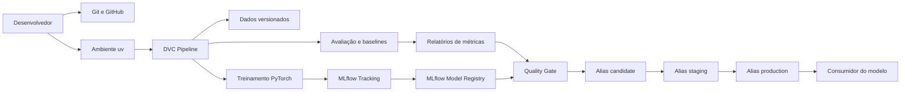
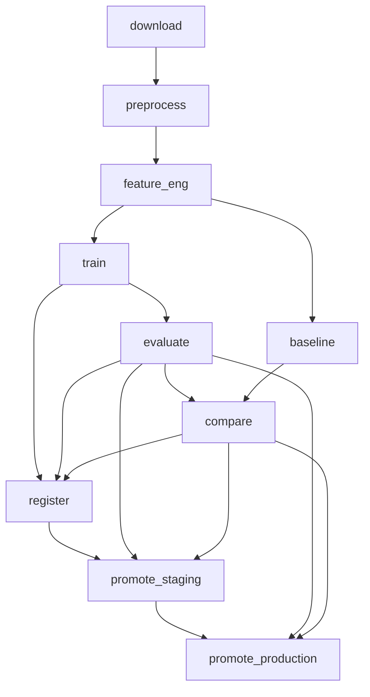
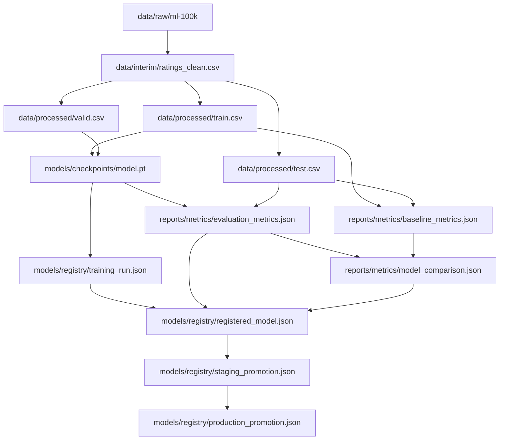
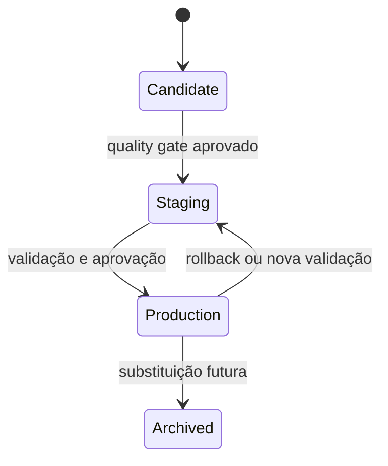
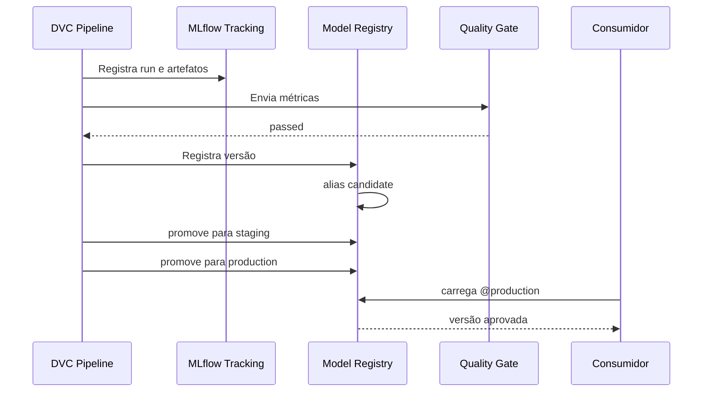
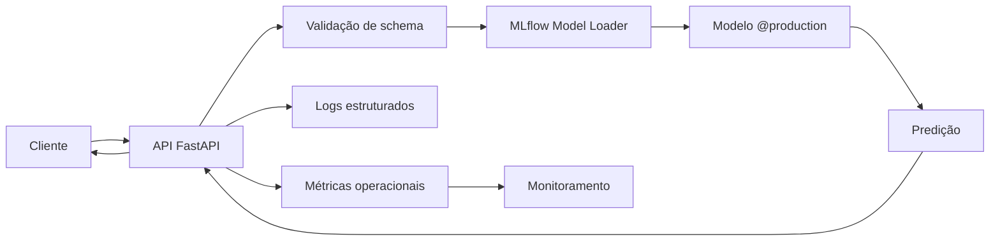

# Arquitetura do Pipeline e do Deploy

## 1. Objetivo

Este documento descreve a arquitetura do projeto
`movielens-recommender-uv`, incluindo:

- organização dos componentes;
- fluxo de dados e modelos;
- pipeline reproduzível com DVC;
- rastreamento de experimentos com MLflow;
- registro e promoção de modelos;
- estratégia atual de entrega;
- estratégia recomendada para serving e rollback;
- limites do escopo atual.

O projeto implementa um fluxo de Machine Learning Engineering orientado a
reprodutibilidade, rastreabilidade e governança.

## 2. Visão geral

A arquitetura integra quatro mecanismos principais:

| Componente | Responsabilidade |
|---|---|
| Git e GitHub | Versionamento de código, configuração e documentação |
| DVC | Orquestração do pipeline e rastreamento de dependências e artefatos |
| MLflow | Experiment Tracking, artefatos de execução e Model Registry |
| Docker Compose | Execução reproduzível dos serviços e do pipeline |

O `uv` gerencia o ambiente Python e mantém as dependências reproduzíveis por
meio de `pyproject.toml` e `uv.lock`.

## 3. Estado atual do deploy

Neste projeto, o termo **deploy** representa a entrega controlada de uma versão
aprovada no MLflow Model Registry.

A versão atualmente aprovada está acessível por:

```text
models:/movielens-mlp-recommender@production
```

O alias `production` é a referência estável para consumidores do modelo.

O projeto ainda não disponibiliza um endpoint público de inferência. Portanto:

- existe entrega e governança no Model Registry;
- existe um artefato aprovado para consumo;
- não existe, neste momento, um serviço HTTP público em produção;
- o serving online é apresentado neste documento como arquitetura de evolução.

Essa distinção evita interpretar o alias `production` como evidência de uma
implantação comercial ativa.

## 4. Arquitetura geral



## 5. Organização em camadas

### 5.1 Camada de configuração

Arquivos principais:

```text
params.yaml
pyproject.toml
uv.lock
.env
.env.example
docker-compose.yml
dvc.yaml
dvc.lock
```

Responsabilidades:

- centralizar hiperparâmetros;
- definir caminhos dos artefatos;
- configurar o MLflow;
- controlar a política de quality gate;
- definir aliases e aprovações;
- fixar versões das dependências;
- declarar o grafo do pipeline.

### 5.2 Camada de dados

Principais diretórios:

```text
data/raw
data/interim
data/processed
```

Fluxo:

```text
MovieLens 100K
      ↓
dados brutos
      ↓
dados limpos
      ↓
train.csv
valid.csv
test.csv
metadata.json
```

### 5.3 Camada de domínio de Machine Learning

Principais módulos:

```text
src/recommender/data
src/recommender/features
src/recommender/models
src/recommender/training
src/recommender/evaluation
src/recommender/inference
```

Responsabilidades:

- leitura e validação do dataset;
- divisão dos dados;
- construção das features;
- criação da MLP;
- treinamento;
- cálculo de métricas;
- comparação com baselines;
- preparação para inferência.

### 5.4 Camada de pipeline

Principais módulos:

```text
src/recommender/pipeline
scripts/run_pipeline.py
scripts/run_baselines.py
scripts/compare_models.py
```

Responsabilidades:

- executar etapas isoladas;
- padronizar entradas e saídas;
- separar preparação, treinamento e avaliação;
- permitir execução local, Docker e DVC.

### 5.5 Camada de persistência

Principal componente:

```text
src/recommender/repositories/artifact_repository.py
```

Responsabilidades:

- salvar métricas;
- salvar metadados;
- persistir arquivos JSON;
- padronizar a escrita de artefatos.

### 5.6 Camada de rastreamento e governança

Principais componentes:

```text
src/recommender/tracking/mlflow_tracker.py
src/recommender/tracking/model_registry.py
src/recommender/tracking/model_promotion.py

scripts/register_model.py
scripts/promote_model.py
```

Responsabilidades:

- criar e registrar runs;
- associar parâmetros, métricas e artefatos;
- registrar versões no Model Registry;
- criar aliases;
- aplicar o quality gate;
- promover para Staging e Production;
- registrar responsável e justificativa;
- permitir rastreabilidade e rollback.

## 6. Pipeline DVC

O pipeline é declarado em `dvc.yaml`.



O DVC analisa dependências, parâmetros e saídas. Quando nada relevante muda,
a etapa é reutilizada. Quando uma entrada, um parâmetro ou um arquivo de código
muda, apenas as etapas afetadas são reexecutadas.

## 7. Etapas do pipeline

### 7.1 `download`

Comando:

```bash
uv run python scripts/download_data.py
```

Responsabilidade:

- baixar o MovieLens 100K;
- extrair os arquivos;
- disponibilizar os dados brutos.

Saída principal:

```text
data/raw/ml-100k
```

### 7.2 `preprocess`

Comando:

```bash
uv run python scripts/run_pipeline.py preprocess
```

Responsabilidade:

- ler os dados brutos;
- validar colunas;
- limpar e padronizar registros.

Saída:

```text
data/interim/ratings_clean.csv
```

### 7.3 `feature_eng`

Comando:

```bash
uv run python scripts/run_pipeline.py feature_eng
```

Responsabilidade:

- dividir os dados;
- construir metadados;
- gerar conjuntos de treino, validação e teste.

Saídas:

```text
data/processed/train.csv
data/processed/valid.csv
data/processed/test.csv
data/processed/metadata.json
```

### 7.4 `train`

Comando:

```bash
uv run python scripts/run_pipeline.py train
```

Responsabilidade:

- criar a MLP;
- treinar com PyTorch;
- calcular métricas de treinamento;
- registrar a execução no MLflow;
- salvar o Run ID usado pelo registro posterior.

Saídas:

```text
models/checkpoints/model.pt
models/registry/training_run.json
reports/metrics/train_metrics.json
```

### 7.5 `evaluate`

Comando:

```bash
uv run python scripts/run_pipeline.py evaluate
```

Responsabilidade:

- carregar o checkpoint;
- executar previsões no conjunto de teste;
- calcular as métricas finais.

Saída:

```text
reports/metrics/evaluation_metrics.json
```

### 7.6 `baseline`

Comando:

```bash
uv run python scripts/run_baselines.py
```

Responsabilidade:

- treinar e avaliar modelos de referência;
- fornecer uma comparação mínima para a MLP.

Modelos avaliados:

```text
dummy_mean
dummy_median
ridge_one_hot
```

Saída:

```text
reports/metrics/baseline_metrics.json
```

### 7.7 `compare`

Comando:

```bash
uv run python scripts/compare_models.py
```

Responsabilidade:

- combinar métricas da MLP e dos baselines;
- classificar os modelos;
- identificar o vencedor pela métrica configurada.

Saída:

```text
reports/metrics/model_comparison.json
```

### 7.8 `register`

Comando:

```bash
uv run python scripts/register_model.py
```

Responsabilidade:

- validar a execução de origem;
- verificar o quality gate;
- registrar ou reutilizar a versão do modelo;
- associar o alias `candidate`;
- persistir os metadados do registro.

Saída:

```text
models/registry/registered_model.json
```

### 7.9 `promote_staging`

Comando:

```bash
uv run python scripts/promote_model.py staging
```

Responsabilidade:

- validar a versão registrada;
- confirmar o Run ID;
- confirmar o quality gate;
- associar o alias `staging`;
- registrar aprovação e justificativa.

Saída:

```text
models/registry/staging_promotion.json
```

### 7.10 `promote_production`

Comando:

```bash
uv run python scripts/promote_model.py production
```

Responsabilidade:

- confirmar que a mesma versão passou por Staging;
- associar o alias `production`;
- registrar aprovação e justificativa;
- tornar a versão disponível para consumidores.

Saída:

```text
models/registry/production_promotion.json
```

## 8. Fluxo de artefatos



## 9. MLflow Tracking

O servidor MLflow é executado pelo Docker Compose:

```bash
docker compose up -d mlflow
```

Interface:

```text
http://localhost:5000
```

O treinamento registra:

- parâmetros;
- métricas;
- artefatos;
- modelo;
- assinatura e exemplo de entrada;
- identificador da execução.

O Run ID da versão atual é:

```text
dce4e464561d4af99f1752d0bbcc87bd
```

## 10. Model Registry e governança

Modelo registrado:

```text
movielens-mlp-recommender
```

Aliases:

```text
candidate
staging
production
```

Fluxo:



A governança registra:

- nome do modelo;
- versão;
- Run ID;
- status;
- métricas;
- limite do quality gate;
- alias;
- responsável;
- justificativa;
- data UTC;
- vencedor da comparação;
- indicação de o modelo ser ou não o vencedor.

## 11. Quality gate

Política atual:

```yaml
quality_gate:
  selection_metric: rmse
  maximum_rmse: 0.26
```

Resultado da MLP:

```text
RMSE: 0.247124
Status: passed
```

A MLP não venceu a comparação geral. O vencedor foi:

```text
ridge_one_hot
```

A promoção foi autorizada porque:

```yaml
require_comparison_winner: false
```

Essa escolha está documentada no Model Card e não deve ser interpretada como
superioridade da MLP.

## 12. Arquitetura atual de entrega

A entrega atual utiliza o Model Registry como fonte da verdade.



URI estável:

```text
models:/movielens-mlp-recommender@production
```

A versão numérica pode mudar sem exigir alteração no consumidor, desde que o
alias seja atualizado para a nova versão aprovada.

## 13. Consumo por alias

Exemplo conceitual com MLflow PyFunc:

```python
import mlflow
import pandas as pd

mlflow.set_tracking_uri("http://localhost:5000")
mlflow.set_registry_uri("http://localhost:5000")

model = mlflow.pyfunc.load_model(
    "models:/movielens-mlp-recommender@production"
)

input_data = pd.DataFrame(
    [{"user_id": 10, "item_id": 42}]
)

prediction = model.predict(input_data)
print(prediction)
```

O consumidor deve:

- apontar para o servidor correto;
- validar o schema;
- tratar usuários e itens desconhecidos;
- registrar a versão usada;
- aplicar limites de timeout e tratamento de erros.

## 14. Arquitetura futura de serving online

Uma evolução possível é disponibilizar uma API FastAPI em contêiner.



Componentes sugeridos:

```text
API FastAPI
Pydantic
MLflow PyFunc
Docker
Prometheus
Grafana
logs JSON
health check
readiness check
```

Endpoints recomendados:

```text
GET  /health
GET  /ready
GET  /version
POST /predict
```

O endpoint `/version` deve expor:

- nome do modelo;
- versão;
- alias;
- Run ID;
- data de carregamento.

## 15. Estratégias futuras de deploy

### 15.1 Blue-Green

Duas versões do serviço ficam disponíveis:

```text
blue  → versão atual
green → nova versão
```

Após validação do ambiente `green`, o tráfego é transferido. Em caso de falha, o
tráfego retorna para `blue`.

### 15.2 Canary

Uma pequena parcela do tráfego utiliza a nova versão. A promoção total ocorre
apenas após validação de:

- latência;
- taxa de erro;
- estabilidade;
- métricas online;
- métricas de negócio.

### 15.3 Batch

Outra possibilidade é utilizar o alias `production` em um job agendado que gere
recomendações em lote.

O deploy, nesse caso, consiste em atualizar o job para carregar sempre:

```text
models:/movielens-mlp-recommender@production
```

## 16. Rollback

O rollback preferencial é realizado alterando o alias `production` para uma
versão anterior validada.

Fluxo:

```text
detecção de incidente
        ↓
identificação da última versão estável
        ↓
alteração do alias production
        ↓
reinicialização ou recarga do consumidor
        ↓
sanity check
        ↓
registro do incidente
```

A versão não deve ser escolhida apenas pelo número. Devem ser verificados:

- Run ID;
- métricas;
- dataset;
- parâmetros;
- aprovação;
- compatibilidade do schema;
- Model Card.

## 17. CI/CD

O projeto possui automação de qualidade com GitHub Actions.

A camada de CI deve executar:

```text
uv sync --locked
ruff
mypy
pytest
pre-commit
uv lock --check
build
```

No estado atual, a promoção para Production não é acionada automaticamente por
todo push.

Essa decisão reduz o risco de uma alteração de código promover um modelo sem
revisão. A promoção permanece explícita no pipeline:

```bash
uv run dvc repro promote_production
```

Uma evolução futura pode separar:

```text
CI
├── lint
├── type check
├── testes
└── build

CD de modelo
├── executar pipeline
├── comparar métricas
├── registrar candidate
├── promover staging
├── aprovação
└── promover production
```

## 18. Modos de execução

### 18.1 Execução local

```bash
uv sync --locked
docker compose up -d mlflow
uv run dvc repro promote_production
```

### 18.2 Execução completa via Docker

O Docker Compose fornece serviços e comandos reproduzíveis para execução do
pipeline em ambiente isolado.

Fluxo conceitual:

```text
host
  ↓
Docker Compose
  ├── mlflow
  └── pipeline/app
```

A aplicação dentro do contêiner deve utilizar:

```text
MLFLOW_TRACKING_URI=http://mlflow:5000
```

A execução local fora do Docker utiliza:

```text
MLFLOW_TRACKING_URI=http://localhost:5000
```

## 19. Observabilidade

Uma implantação online deve registrar:

### Operação

- latência;
- throughput;
- taxa de erro;
- uso de CPU;
- uso de memória;
- disponibilidade.

### Dados

- usuários desconhecidos;
- itens desconhecidos;
- campos ausentes;
- tipos inválidos;
- mudanças de distribuição.

### Modelo

- versão;
- Run ID;
- alias;
- distribuição das previsões;
- RMSE e MAE quando o valor real estiver disponível;
- cobertura;
- diversidade;
- novidade.

O plano detalhado deve ser mantido em:

```text
docs/monitoring.md
```

## 20. Segurança

Práticas obrigatórias:

- não versionar segredos;
- manter `.env` fora do Git;
- fornecer apenas `.env.example`;
- limitar acesso ao MLflow;
- proteger o storage de artefatos;
- validar entradas;
- registrar ações de promoção;
- restringir quem pode alterar o alias `production`;
- revisar dependências;
- executar o serviço com usuário não privilegiado no contêiner.

## 21. Reprodutibilidade

A reprodução depende da combinação:

```text
commit Git
+ dvc.lock
+ params.yaml
+ uv.lock
+ Run ID MLflow
+ versão do modelo
```

Comandos principais:

```bash
uv sync --locked
docker compose up -d mlflow
uv run dvc status
uv run dvc repro
```

Validação:

```bash
make check
uv run dvc status
git diff --check
```

## 22. Artefatos de arquitetura e governança

| Artefato | Caminho |
|---|---|
| Definição do pipeline | `dvc.yaml` |
| Estado reproduzível do pipeline | `dvc.lock` |
| Parâmetros | `params.yaml` |
| Modelo | `models/checkpoints/model.pt` |
| Run de treinamento | `models/registry/training_run.json` |
| Registro | `models/registry/registered_model.json` |
| Promoção Staging | `models/registry/staging_promotion.json` |
| Promoção Production | `models/registry/production_promotion.json` |
| Métricas | `reports/metrics` |
| Model Card | `docs/model_card.md` |
| Arquitetura | `docs/architecture.md` |
| Monitoramento | `docs/monitoring.md` |

## 23. Limitações atuais

- não existe endpoint público;
- não existe deploy em Kubernetes;
- não existe estratégia canary implementada;
- não existe recarga automática do modelo após mudança do alias;
- não existe monitoramento online;
- não existe retreinamento contínuo;
- não existe aprovação externa por comitê;
- o MLflow está configurado para ambiente local de demonstração.

Esses itens representam evoluções possíveis, não funcionalidades já concluídas.

## 24. Decisões arquiteturais

### Uso do DVC

Motivo:

- representar o pipeline como código;
- controlar dependências;
- evitar recomputação desnecessária;
- reproduzir resultados.

### Uso do MLflow

Motivo:

- rastrear experimentos;
- registrar artefatos;
- ligar o modelo à execução de origem;
- governar versões e aliases.

### Uso de aliases

Motivo:

- fornecer identificadores estáveis;
- separar nome lógico e número da versão;
- facilitar promoção e rollback.

### Quality gate independente do vencedor

Motivo:

- a entrega possui finalidade educacional;
- a MLP é o modelo principal do projeto;
- a MLP passou no limite absoluto definido;
- o baseline vencedor está documentado.

### Promoção explícita

Motivo:

- evitar promoção acidental;
- registrar aprovação;
- tornar o fluxo auditável.

## 25. Referências internas

```text
README.md
docs/model_card.md
docs/monitoring.md
params.yaml
dvc.yaml
docker-compose.yml
.github/workflows/ci.yml
```

Este documento deve ser atualizado sempre que houver:

- mudança no grafo DVC;
- novo serviço de inferência;
- alteração no Docker Compose;
- mudança no Model Registry;
- nova estratégia de deploy;
- inclusão de monitoramento;
- alteração no processo de rollback;
- mudança no CI/CD.
